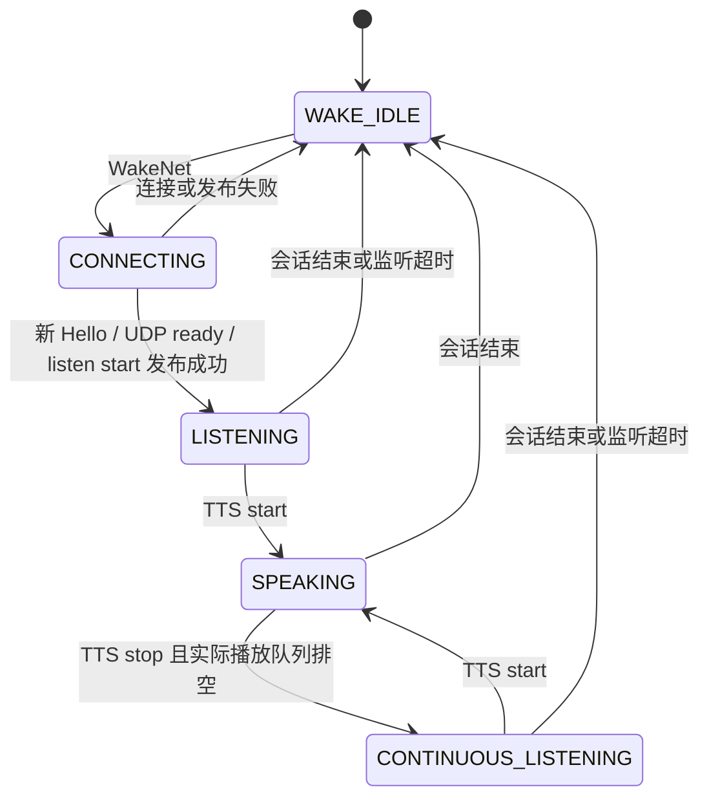

# 共享双麦 AFE 语音状态机（2026-09-27）

## 后续更新：精简运行日志

麦克风采集任务不再同步打印每 5 秒的七行诊断；仅累计窗口数据。
现有语音控制任务取得快照、释放采集锁后，每 5 秒输出一行 `VOICE_STATUS`，
明确显示“待机-等待你好小智 / 建立会话 / 播报中 / 监听中-请直接说话 / RTC暂停唤醒”。
保留 wake、uplink、feed/fetch、empty、hits、VAD、S/N（语音/静音帧数）、tx 和双麦峰值。
仅在数据不守恒、feed/输出/发送错误或削顶时额外打印异常行。
状态切换和欠压等错误仍保留，启动内存预算整页清单改为 DEBUG。
下文原先的 AFE_DIAG/VAD_DIAG/UPLINK_DIAG 已合并为此摘要；双麦算法和唤醒阈值未调整。
精简版两个构建目录均已编译通过，四组主机回归脚本通过；尚未实机验证。
最新 `build_rtc_mem_b` ELF SHA256：`c222150f9a17f898a761282256d7426af051d8218d051c5de390b61ca22d216d`。
构建/测试日志：根目录 `logs/build_voice_quiet*.log`、`logs/test_voice_quiet.log`。

参考项目已使用的组件库 `espressif/esp-sr 2.3.1`，以及小智官方
[AfeAudioEngine](https://github.com/78/xiaozhi-esp32/blob/main/main/audio/engines/afe_audio_engine.cc)
与 [Application](https://github.com/78/xiaozhi-esp32/blob/main/main/application.cc)。
对齐独立的 WakeWordDetection / VoiceProcessing 门控与事件处理机制；未照搬官方
FD LOW COST 算法配置，保留本项目已验证的 SR HIGH PERF、BSS、VAD、WakeNet。

## 状态与门控

| 状态 | WakeNet | VoiceProcessing（增强 PCM 输出） | MicUplink |
|---|---:|---:|---:|
| WAKE_IDLE | 1 | 0 | 0 |
| CONNECTING | 0 | 0 | 0 |
| LISTENING | 0 | 1 | 1 |
| SPEAKING，包括播放尾部 | 0 | 0 | 0 |
| CONTINUOUS_LISTENING | 0 | 1 | 1 |
| RTC 生命周期暂停 | 0，AFE 已释放 | 0 | 0 |

普通会话关闭 VoiceProcessing 只清理增强 PCM 输出缓存，AFE 仍持续消费双麦/REF，
维护 AEC、VAD；VAD 不决定是否上传。RTC 暂停则是完整释放 AFE 的独立生命周期操作。

## 修改文件与函数

- `components/xiaozhi_audio/xiaozhi_audio.c`
  - `set_voice_state`：统一状态、WakeNet、VoiceProcessing、上传门控，输出 old→new 和完整开关状态；无就绪通道不得开启监听。
  - `post_voice_event / handle_voice_event / wake_process_task`：复用原大栈任务串行处理网络/唤醒事件、播放排空、30 秒无新 STT 超时；控制队列放 PSRAM。队列满时结束会话，不静默遗失 stop。
  - `process_detected_wake_word`：先 CONNECTING，冻结前置音频，重新 Hello/UDP，再进入 LISTENING；活动会话不重复唤醒。
  - `enter_wake_idle`：关门控、清增强 PCM 缓存、停 UDP、清 session、恢复 WakeNet；未播放 PCM 由原池正常归还。
  - `resume_listening_after_playback`：必须 TTS stop、解码/播放队列无工作，再等待 120ms 尾部余量（当前 I2S DMA 最多约 60ms）；发布失败统一退回待机。
  - `capture_task`：门控仍是 CHANNEL_ACTIVE + UPLINK_ENABLED，没有 VAD 条件；和状态/AFE 销毁互斥，防止旧帧越过状态边界发送。
  - `report_audio_stats`：增加 VAD_DIAG / UPLINK_DIAG；AFE 重建后按实例代次重置统计窗口。
  - `xiaozhi_audio_set_rtc_suspended`：向语音任务同步请求释放/恢复 AFE。RTC 期间继续排空硬件 I2S，但不 feed/fetch AFE、不上传。
- `components/xiaozhi_audio/wake_word.c/.h`
  - `wake_word_enable_voice_processing`：独立于 WakeNet 的增强 PCM 输出开关；切换清旧输出缓存。
  - `handle_voice_result`：真实 VAD 变化只更新状态/边沿计数，SPEECH 与 SILENCE 都进入同一 PCM 输出分支。
  - `wake_word_deinit / detection_task`：等待 fetch 任务主动退出后销毁 AFE，避免删除正在持锁的任务。
- `components/xiaozhi_audio/xiaozhi_audio.h`：增加 RTC 生命周期接口。
- `components/webrtc_whip/webrtc_whip.c`、`include/webrtc_whip.h`：注册音频生命周期回调；H264 资源申请前释放 AFE；视频停止、Peer 释放后恢复 AFE，失败明确记录。
- `main/main.c`：连接 RTC 与语音回调，不增加组件循环依赖。
- `tools/test_voice_state.py`、`tools/test_afe_output.py`：编译实际 C 函数的主机回归测试。
- `tools/test_afe_accumulator.py`：适配函数名边界；守恒测试逻辑不变。

## 与原实现的差异和保留项

原实现已经共享一个 AFE，且没有用 VAD 丢弃静音。本次没有把历史故障直接归因于 VAD。
原先连接准备期提前标记 LISTENING，网络回调、采集任务和播放任务分别切换状态，部分
listen-stop/发布失败路径仅开启 WakeNet、未清 session。这些边界改为单一控制任务管理。

保留 SLOT0=MIC1、SLOT1=REF、SLOT2=MIC2、SLOT3=unused → MMR，24k→16k 重采样，
10ms 采集批次，feed=1024 samples/channel、fetch=512 samples，持久 accumulator。
不修改任务核/优先级、视频分辨率、H264 或 DMA 布局策略。

保留现有同步 `cloud_udp_send_opus`，未额外引入音频 UDP 队列。关上传门控时等待正在执行
的一次采集/编码/发送完成，然后清 PCM 缓存；因此无额外排队 Opus 可泄漏进下一会话。
唤醒 preroll 在 CONNECTING 中独占编码器发送，实时音频上行尚未开启。

30 秒无新 STT 是本项目的监听超时策略，不是官方协议硬性规定；两种监听状态都使用该策略。
不会由单帧 SILENCE 结束监听，也不以本地 VAD 强行续期。QoS0 发布成功只代表本地发送调用
成功，不证明服务端已启动 ASR。

## 日志与验收

每次状态切换：`VOICE_STATE old -> new wake_enabled=... voice_processing_enabled=... mic_uplink=... vad_state=... session_ready=...`。
每 5 秒保留 AFE_FLOW/AFE_DIAG，新增 VAD_DIAG（speech/silence、begin/end、当前状态）
和 UPLINK_DIAG（pcm_frames、opus_packets、udp_packets、drop）。UPLINK_DIAG 统计实时音频，
preroll 仍单独报告；AFE 输出缓冲满计入原 out_drop。

以下是待实机验收步骤，不是已获得的串口结果：

1. 待机静音 30 秒：WAKE_IDLE，wake=1、processor=0、uplink=0，不自动创建会话。
2. 说“你好小智”：CONNECTING → LISTENING，新 session ready 后才出现实时上行。
3. 随后静音 3–5 秒：观察真实 `current_vad=SILENCE` 与 `silence_frames`；若仍全部 SPEECH，保留日志继续查 AFE 输入，不伪造状态。
4. 静音→说话→静音：speech_begin / speech_end 增加。
5. LISTENING 的静音窗口：PCM/Opus/UDP 计数仍增长，门控保持开启。
6. 收到 TTS start：SPEAKING，wake=0、processor=0、uplink=0。窗口计数可能含切换前部分，下一完整播报窗口应为 0。
7. TTS stop 后等真实队列排空与尾部余量：CONTINUOUS_LISTENING，无需再次唤醒即可说话。
8. 30 秒无新 STT：回 WAKE_IDLE，重新说唤醒词可以新建会话。
9. RTC start：H264 申请之前出现 `RTC_AUDIO suspended AFE=released`；RTC stop：`RTC_AUDIO restore=ESP_OK` 后重新出现 2MIC/MMR 和 WAKE_IDLE。若恢复失败，不得当成唤醒已恢复。

当前主机测试已通过：真实状态函数门控、无 Hello 禁止上传、迟到会话过滤、TTS 排空、
发布失败清理、RTC 门控；真实 AFE 输出函数验证静音字节完整、VAD 边沿和过期 fetch 拒收；
双麦重排/重采样和 8 组 accumulator 守恒测试。

尚未烧录或取得本版实机日志；连续对话、真实 VAD、RTC 释放/恢复与资源余量仍须以上实测确认。
固件与构建日志见 `build_rtc_mem_b/`、`build/` 和项目根目录 `logs/`。

本轮两个构建目录已成功生成固件。IDF 扩展当前选择 `build_rtc_mem_b`，对应 ELF SHA256
为 `f5cf73f6490d0852d70bc405a1e425e6b6ffd5291c165aad768a3501847a6f90`。
主机测试结果保存在 `logs/test_voice_state.log`；没有执行烧录。
